# Bundesliga 3D Football - Shooting BSQ

Body-Strike Quality, or **BSQ**, is a reproducible shooting KPI built for Challenge 2 of the Bundesliga AWS World Sports Innovation Cup 2026. It turns synchronized Bundesliga KPI events, 50 Hz 3D skeleton parquet, and ball tracking into a multi-phase explanation of **why a shot was good or bad before the final result is known**.

The submission has three parts:

1. **Metric pipeline**: parse KPI shot events, align them to skeleton frames, extract tiny S3 parquet windows, compute biomechanics and ball-flight features, and write BSQ tables.
2. **Judge-facing notebooks**: executed notebooks explain the formulation, reproduce league/player dashboards, and display derived outputs without requiring AWS during review.
3. **3D review artifacts**: a local browser visualizer and Remotion video source for shot-review clips.

Public repo: `https://github.com/tayyab415/bsq`

## Table of Contents

- [What BSQ Measures](#what-bsq-measures)
- [Repository Layout](#repository-layout)
- [Data Policy](#data-policy)
- [Quick Start Without AWS](#quick-start-without-aws)
- [Full Reproduction With AWS](#full-reproduction-with-aws)
- [Dataset and Frame Alignment](#dataset-and-frame-alignment)
- [Metric Formulation](#metric-formulation)
- [Feature Scoring Primitives](#feature-scoring-primitives)
- [Phase Formulations](#phase-formulations)
- [Module Formulations](#module-formulations)
- [Final BSQ Aggregation](#final-bsq-aggregation)
- [Decision Quality and Pass Routing](#decision-quality-and-pass-routing)
- [Finishing Execution Index](#finishing-execution-index)
- [Confidence, Missing Data, and Audit Fields](#confidence-missing-data-and-audit-fields)
- [Outputs and Validation](#outputs-and-validation)
- [Output Gallery](#output-gallery)
- [Visualizer](#visualizer)
- [Remotion Videos](#remotion-videos)
- [Hackathon Deliverables](#hackathon-deliverables)
- [Troubleshooting](#troubleshooting)

## What BSQ Measures

Classical event data can say where a shot happened, who shot it, and whether it became a goal. BSQ adds the missing physical layer from 3D tracking:

- Was the shot choice good relative to the context and pass options?
- Was the body prepared before contact?
- Did the hips, shoulders, support leg, striking foot, and trunk move in a credible shooting sequence?
- Was contact near the expected striking limb and plant-foot geometry?
- Did the ball leave with useful speed, launch, alignment, and goal-plane placement?
- How confident is the score given tracking quality and contact-frame certainty?

The core idea is that a shot is not one scalar event. It is a sequence:

```text
context -> approach -> backswing/loading -> contact -> follow-through -> ball flight
```

BSQ therefore scores six phases, rolls them into football-readable modules, and combines those modules with family-specific weights. The score is not just "did it go in"; xG and outcome are audit/context fields, while the main scores are built from decision context, 3D body mechanics, and post-contact ball physics.

## Repository Layout

| Path | Purpose |
|------|---------|
| `README.md` | This self-contained formulation and reproduction guide |
| `pyproject.toml` | Python package metadata and optional dependency groups |
| `configs/matches.yaml` | Five match folder names and demo shot IDs |
| `docs/` | Supporting docs retained for audit trails and shorter references |
| `metrics-calculation/` | Main BSQ pipeline, notebooks, reference outputs, and scripts |
| `metrics-calculation/shooting1/` | Metric implementation: parsing, feature engineering, scoring, S3 extraction |
| `metrics-calculation/notebooks/` | Executed methodology, computation, dashboard, and player-profile notebooks |
| `metrics-calculation/reference_outputs/` | Small derived BSQ tables and validation report for no-AWS notebook review |
| `src/aws_football/` | Shared utilities for reports, visualizations, frame alignment, S3/parquet access, fonts |
| `visualizer/` | Local 3D shot-review web app and server script |
| `shooting-videos/` | Remotion compositions and JSON props for explainer clips |
| `outputs/` | Small committed visual proof artifacts only, not raw tracking data |
| `scripts/reproduce.sh` | One-command metric reproduction entrypoint |
| `submission/` | Submission templates such as `github_link.txt.example` |

## Data Policy

This repository is public and intentionally **does not contain the official match dataset**.

The challenge data must not be uploaded to GitHub. The full official data remains in the organizers' AWS/S3 environment or in a local folder outside this clone. The repo may contain source code, docs, notebooks, small visual proof files, and small derived reference tables. It must not contain raw feed files.

Forbidden in git:

| Forbidden item | Examples |
|----------------|----------|
| Skeleton parquet | `*.parquet`, full skeleton/ball columns |
| Positional XML | `Positions_*.xml` |
| KPI/event/match XML | `kpi_data_*.xml`, `Events_*.xml`, `MatchInformations_*.xml` |
| Metadata JSON | `*_metadata.json` |
| Local mirrors | `data-small/`, `data/`, `Match_Data/` |
| Credentials | `.env`, `aws-hackathon.env`, API keys, session tokens |
| Bulk local outputs | Full regenerated `metrics-calculation/outputs/` tables |
| Rendered video outputs | Large local `*.mp4` render outputs |

The intended split is:

```text
GitHub repo (public)                         Outside repo / AWS
--------------------------------------       -----------------------------------
source code                                  official XML and metadata bundle
formulation docs                             official S3 parquet skeleton files
executed notebooks with derived plots         local regenerated full outputs
small reference outputs                       credentials and AWS session files
visualizer/video source                       rendered submission video
```

The `.gitignore` enforces these rules for common accidental paths.

## Quick Start Without AWS

Use this path to inspect the submission and notebooks without official credentials.

```bash
python3.11 -m venv .venv
source .venv/bin/activate
pip install --upgrade pip
pip install -e ".[notebooks]"
jupyter lab metrics-calculation/notebooks/
```

Recommended reading order:

1. `metrics-calculation/notebooks/00_methodology_and_formulation.ipynb`
2. `metrics-calculation/notebooks/01_pipeline_computation.ipynb`
3. `metrics-calculation/notebooks/02_five_match_league_dashboard.ipynb`
4. `metrics-calculation/notebooks/03_player_profile_harry_kane.ipynb`
5. `metrics-calculation/notebooks/04_player_profile_michael_olise.ipynb`
6. `metrics-calculation/notebooks/05_metric_leaderboards.ipynb`

The no-AWS path uses committed derived outputs in `metrics-calculation/reference_outputs/`. Those tables are derived BSQ outputs for reviewer convenience, not raw tracking feeds.

## Full Reproduction With AWS

Use this path to regenerate the full score tables from official data.

### 1. Create environment

```bash
python3.11 -m venv .venv
source .venv/bin/activate
pip install --upgrade pip
pip install -e ".[metrics,notebooks]"
```

### 2. Configure data outside the repo

Set `HACKATHON_DATA_ROOT` to a folder outside this clone:

```bash
export HACKATHON_DATA_ROOT="$HOME/bundesliga-challenge2-data"
```

Expected local layout:

```text
$HACKATHON_DATA_ROOT/
  Match_Data/
    Bayern_Hamburg/
      *_metadata.json
      MatchInformations_*.xml
      kpi_data_*.xml
      Events_*.xml
    Bayern_Union/
      ...
    Frankfurt_Bayern/
      ...
    Leipzig_Bayern/
      ...
    Bayern_Stuttgart/
      ...
```

The skeleton parquet files stay in S3 and are read at runtime by row-group pruning.

### 3. Configure AWS

```bash
export AWS_PROFILE=hackathon
export AWS_REGION=eu-central-1
aws sts get-caller-identity
```

If credentials expire, refresh through the hackathon login process for the local environment.

### 4. Run the pipeline

```bash
./scripts/reproduce.sh
```

Single-match run:

```bash
./metrics-calculation/scripts/run_single_match.sh Bayern_Hamburg
```

Smoke test without S3 parquet reads:

```bash
./scripts/reproduce.sh --no-s3 --max-windows-per-match 2
```

Expected local output directory:

```text
metrics-calculation/outputs/all_matches/
  shots.csv
  features.csv
  scores_v1.csv
  review_rows.csv
  contact_candidates.csv
  router_audit.csv
  players.csv
  validation_report.md
```

`metrics-calculation/outputs/` is gitignored.

## Dataset and Frame Alignment

The official Challenge 2 data has five matches:

```text
Bayern_Hamburg
Bayern_Union
Frankfurt_Bayern
Leipzig_Bayern
Bayern_Stuttgart
```

The pipeline fuses these data families:

| Source | Frequency / role | Used for |
|--------|------------------|----------|
| KPI XML | event-level, synchronized to positional frame IDs | shot events, xG audit column, pressure, pass/reception context, shot outcome |
| Match information XML | match roster metadata | teams, players, shirt numbers |
| Metadata JSON | match-level frame metadata | pitch size, phase start/end frames, frame-rate alignment |
| Skeleton parquet | 50 Hz, S3 only | 21 body parts, ball position/velocity, contact windows |
| Positions XML | 25 Hz, optional | whole-team x/y fallback for pass routing |

The skeleton parquet schema provides ball columns and nested player skeletons:

```text
frame_number
ball.position_x/y/z
ball.velocity_x/y/z
ball_exists
skeleton_count
skeletons[].team
skeletons[].jersey_number
skeletons[].parts_count
skeletons[].parts[].name
skeletons[].parts[].position_x/y/z
```

Each sampled skeleton has 21 body parts:

```text
left_ear, nose, right_ear,
left_shoulder, neck, right_shoulder,
left_elbow, right_elbow,
left_wrist, right_wrist,
left_hip, pelvis, right_hip,
left_knee, right_knee,
left_ankle, right_ankle,
left_heel, left_toe,
right_heel, right_toe
```

KPI `SyncedFrameId` values use 25 Hz phase-relative numbering, while parquet skeleton uses absolute 50 Hz frame numbers. The phase-aware alignment is:

```text
First half:
skeleton_frame = Phase1StartFrame + 2 * (KPI_SyncedFrameId - 10000)

Second half:
skeleton_frame = Phase2StartFrame + 2 * (KPI_SyncedFrameId - 100000)
```

The implementation validates this per match/phase and then extracts only a small window around each shot. Production reads are row-group pruned by `frame_number` min/max before flattening nested skeleton rows.

## Metric Formulation

BSQ has three layers:

1. **Raw feature layer**: event geometry, pressure, body landmarks, ball trajectory, contact-frame candidates, and quality flags.
2. **Phase layer**: six time windows around contact, P1 through P6.
3. **Module layer**: football-readable modules such as decision quality, technique mechanics, strike quality, placement, and strike output.

The score uses normalized subscores in `[0, 1]` and reports many final values on a `0-100` scale. Where the code emits a confidence-gated score, the result is `None` if the relevant confidence is below the reporting threshold.

### Shot Families

The pipeline resolves each shot into a family because good mechanics differ by shot type:

| Family | Typical interpretation |
|--------|------------------------|
| `oneV` | one-v-one / high-control finish |
| `open_play` | normal open-play shot |
| `cutback` | shot from cutback / quick reception context |
| `long_range` | longer distance strike |
| `volley` | airborne or volley-like contact |
| `header` | headed attempt |
| `dead_ball` | restart, free kick, penalty, corner context |
| `carry_self_created` | self-created shot after carry/dribble progression |

The family affects context weights, approach targets, technique phase weights, strike-output targets, and final D/T/B/C/V aggregation.

### Six Phases

All phase windows are relative to the selected contact frame at 50 Hz:

| Phase | Frames relative to contact | Approx. time | Meaning |
|-------|----------------------------|--------------|---------|
| P1 | `-125 ... -51` | `-2.50s ... -1.02s` | context, distance, angle, lane, pressure, keeper, previous event |
| P2 | `-50 ... -14` | `-1.00s ... -0.28s` | approach, preparation, stride, body-ball readiness |
| P3 | `-13 ... -2` | `-0.26s ... -0.04s` | backswing, coil, loading, support-leg stability |
| P4 | `-2 ... +2` | `-0.04s ... +0.04s` | impact, contact geometry, foot-ball transfer |
| P5 | `+2 ... +25` | `+0.04s ... +0.50s` | follow-through, balance, path continuation |
| P6 | `+25 ... +75` | `+0.50s ... +1.50s` | post-strike ball flight, goal-plane placement, exit physics |

### Notation

The README uses:

```text
clip(x, 0, 1) = min(1, max(0, x))

lin_high(x; lo, hi) = clip((x - lo) / (hi - lo), 0, 1)
lin_low(x; best, worst) = clip(1 - (x - best) / (worst - best), 0, 1)

soft_band(x; lo, hi, margin_lo, margin_hi) =
  1                                  if lo <= x <= hi
  clip(1 - (lo - x) / margin_lo)     if x < lo
  clip(1 - (x - hi) / margin_hi)     if x > hi

weighted_available_mean((score_i, weight_i, available_i), neutral=0.5) =
  sum(score_i * weight_i for available finite items) / sum(weight_i)
  or neutral if no items are available
```

These are implemented in `metrics-calculation/shooting1/metric.py` as `lin_high`, `lin_low`, `soft_band`, and `weighted_mean_available`.

## Feature Scoring Primitives

The following primitive feature scores are used repeatedly:

| Feature score | Formula / target |
|---------------|------------------|
| Distance context | lower distance is better: `lin_low(distance_to_goal, 6, 28)` in legacy D components |
| Angle context | wider angle is better: `lin_high(angle_to_goal, 5, 45)` |
| Lane defenders | fewer defenders in lane: `lin_low(num_defenders_in_lane, 0, 5)` |
| Pressure | less pressure: `lin_low(pressure, 0, 3)` |
| Keeper proxy | more keeper displacement/opening: `lin_high(keeper_distance_to_goal, 0, 8)` in legacy components |
| Contact-near-ankle | `exp(-max(0, distance_to_ankle - ball_radius) / 0.18)` |
| Ball radius | `0.11 m` |
| Contact certainty jump | ball position-delta jump above `15.0 m/s` is physically decisive |
| Torso extreme penalty | `lin_low(max(0, abs(torso_lean_deg) - 35), 0, 25)` |
| Foot peak velocity | `lin_high(foot_peak_velocity_m_s, 10, 20)` |
| Knee peak angular velocity | `lin_high(knee_peak_dps, 800, 1600)` |
| Non-kicking arm abduction | `soft_band(deg, 90, 160, 30, 20)` |
| Goal lateral placement | inside goal mouth `[-3.66, 3.66]` with corner bonus |
| Goal vertical placement | family-specific vertical soft band |
| Trajectory flatness | low normalized max deviation from early flight line is better |

## Phase Formulations

### P1: Context

P1 combines static/event context before the approach:

```text
P1_score = 100 * weighted_available_mean(
  distance_context,
  angle_context,
  pressure_context,
  defenders_lane,
  keeper_proxy,
  previous_event_type,
  receiver_is_shooter,
  time_to_shot,
  ball_height,
  family_context_affordance
)
```

Family weights:

| Family | distance | angle | pressure | lane | keeper | previous | receiver | time | height | context |
|--------|----------|-------|----------|------|--------|----------|----------|------|--------|---------|
| `oneV` | 0.16 | 0.14 | 0.16 | 0.12 | 0.16 | 0.08 | 0.08 | 0.06 | 0.02 | 0.02 |
| `open_play` | 0.14 | 0.14 | 0.18 | 0.16 | 0.10 | 0.08 | 0.06 | 0.06 | 0.02 | 0.06 |
| `cutback` | 0.10 | 0.12 | 0.18 | 0.15 | 0.10 | 0.13 | 0.12 | 0.08 | 0.01 | 0.01 |
| `long_range` | 0.08 | 0.10 | 0.22 | 0.20 | 0.16 | 0.04 | 0.02 | 0.04 | 0.02 | 0.12 |
| `volley` | 0.10 | 0.10 | 0.12 | 0.12 | 0.10 | 0.16 | 0.10 | 0.10 | 0.08 | 0.02 |
| `header` | 0.12 | 0.12 | 0.12 | 0.12 | 0.10 | 0.16 | 0.08 | 0.06 | 0.10 | 0.02 |
| `dead_ball` | 0.18 | 0.16 | 0.04 | 0.12 | 0.18 | 0.08 | 0.00 | 0.00 | 0.04 | 0.20 |
| `carry_self_created` | 0.08 | 0.10 | 0.18 | 0.16 | 0.12 | 0.12 | 0.02 | 0.04 | 0.02 | 0.16 |

Important sub-targets:

```text
time_score(dead_ball) = 0.7
time_score(oneV/cutback/volley) = lin_low(time_to_shot_s, 0.0, 1.5)
time_score(other) = soft_band(time_to_shot_s, 0.4, 4.0, 0.4, 3.0)

ball_height_score(volley) = lin_high(ball_height_m, 0.35, 1.2)
ball_height_score(other) = soft_band(ball_height_m, 0.0, 0.35, 0.05, 0.45)
```

### P2: Approach and Preparation

P2 scores how the shooter approaches the ball and prepares for contact:

```text
P2_score = 100 * weighted_available_mean(
  approach_speed,
  approach_angle,
  prep_touch_offset,
  ball_shooter_convergence,
  trunk_approach,
  stride_smoothness,
  timing,
  body_ball_readiness
)
```

Family weights:

| Family | speed | angle | prep | convergence | trunk | stride | timing | readiness |
|--------|-------|-------|------|-------------|-------|--------|--------|-----------|
| `oneV` | 0.12 | 0.10 | 0.12 | 0.20 | 0.10 | 0.06 | 0.20 | 0.10 |
| `open_play` | 0.14 | 0.14 | 0.14 | 0.16 | 0.12 | 0.06 | 0.14 | 0.10 |
| `cutback` | 0.10 | 0.08 | 0.14 | 0.20 | 0.10 | 0.04 | 0.22 | 0.12 |
| `long_range` | 0.18 | 0.18 | 0.22 | 0.08 | 0.12 | 0.10 | 0.05 | 0.07 |
| `volley` | 0.05 | 0.05 | 0.05 | 0.20 | 0.15 | 0.00 | 0.20 | 0.30 |
| `header` | 0.06 | 0.06 | 0.04 | 0.16 | 0.24 | 0.00 | 0.20 | 0.24 |
| `dead_ball` | 0.15 | 0.20 | 0.20 | 0.05 | 0.15 | 0.10 | 0.00 | 0.15 |
| `carry_self_created` | 0.20 | 0.12 | 0.12 | 0.14 | 0.16 | 0.08 | 0.06 | 0.12 |

Approach target functions:

```text
approach_speed(long_range/dead_ball) = soft_band(speed, 2.5, 6.5, 1.5, 2.5)
approach_speed(volley) = soft_band(speed, 0.3, 4.0, 0.3, 2.0)
approach_speed(other) = soft_band(speed, 1.0, 4.5, 1.0, 2.0)

approach_angle(long_range/dead_ball) = soft_band(angle, 25, 45, 15, 25)
approach_angle(volley) = soft_band(angle, 0, 60, 5, 35)
approach_angle(other) = soft_band(angle, 0, 35, 5, 30)

trunk_approach(volley) = soft_band(lean, 0, 35, 5, 25)
trunk_approach(other) = soft_band(lean, 5, 25, 5, 20)
```

Prep touch offset:

```text
forward_score(long_range/dead_ball) = soft_band(forward, 0.9, 1.4, 0.5, 0.7)
forward_score(volley) = soft_band(forward, 0.1, 1.6, 0.4, 1.0)
forward_score(other) = soft_band(forward, 0.2, 1.1, 0.4, 0.8)
lateral_score = soft_band(abs(lateral), 0.1, 0.8, 0.1, 0.5)
prep_touch_offset = mean(forward_score, lateral_score)
```

### P3: Backswing, Coil, and Loading

P3 is the main biomechanics-loading phase. It scores:

| Component | Feature | Meaning |
|-----------|---------|---------|
| `com` | `com_over_plant_foot_score` | center of mass over plant/support base |
| `shoulder` | `shoulder_hip_score` | shoulder-hip separation / X-factor |
| `knee` | `knee_stability_score` | support-leg stability |
| `knee_peak` | `knee_peak_angular_velocity_score` | loading angular velocity |
| `arm` | `non_kicking_arm_abduction_score` | counter-balance arm position |
| `foot_peak` | `foot_peak_velocity_score` | striking-foot speed near contact preparation |

Weights:

| Family | com | shoulder | knee | knee_peak | arm | foot_peak |
|--------|-----|----------|------|-----------|-----|-----------|
| default | 0.25 | 0.20 | 0.20 | 0.15 | 0.10 | 0.10 |
| `cutback` | 0.35 | 0.10 | 0.20 | 0.15 | 0.10 | 0.10 |
| `volley` | 0.25 | 0.10 | 0.15 | 0.10 | 0.15 | 0.25 |
| `carry_self_created` | 0.30 | 0.14 | 0.20 | 0.18 | 0.10 | 0.08 |

Shoulder-hip scoring is family-specific:

```text
cutback:             lin_low(max(0, separation - 5), 0, 20)
carry_self_created:  soft_band(separation, 10, 25, 8, 15)
long_range/dead_ball: soft_band(separation, 30, 45, 20, 15)
volley:              soft_band(separation, 15, 30, 15, 20)
header:              unavailable / not used
other:               soft_band(separation, 10, 35, 10, 15)
```

### P4: Impact and Strike Split

P4 is split into:

```text
P4_mech   = impact geometry and sequencing
P4_strike = foot-to-ball transfer and strike-path quality
P4_score  = combined impact score
```

Representative inputs:

- `contact_near_ankle_score`
- `plant_foot_forward_offset_m`
- `plant_foot_lateral_offset_m`
- `foot_velocity_into_ball_score`
- `foot_path_stability`
- `proximal_distal_sequencing_score`
- `position_delta_jump_score`
- `ball_to_foot_speed_ratio_score`

Plant-foot targets:

```text
plant_forward_score = soft_band(-plant_forward_offset_m, 0.05, 0.10, 0.20, 0.25)
plant_lateral_score = soft_band(abs(plant_lateral_offset_m), 0.05, 0.28, 0.10, 0.25)
```

Ball-to-foot speed ratio:

```text
if foot_speed < 2.0 m/s: unavailable
if ratio > 8.0: unavailable

oneV/open_play/cutback/carry_self_created: soft_band(ratio, 1.6, 2.4, 0.4, 0.8)
long_range/dead_ball:                     soft_band(ratio, 1.8, 3.0, 0.4, 0.8)
volley:                                   soft_band(ratio, 1.5, 2.4, 0.4, 0.6)
fallback:                                 soft_band(ratio, 1.05, 1.65, 0.35, 0.5)
```

Headers treat foot-strike fields as unavailable where inappropriate.

### P5: Follow-Through

P5 scores post-impact body continuation:

```text
P5_score = weighted/available combination of:
  com_continuation_score
  follow_through_path_score
  post_impact_balance_score
```

The implementation aligns continuation with the shot/ball direction so that follow-through rewards balanced movement through the strike rather than arbitrary movement after contact.

### P6: Ball Flight and Outcome Physics

P6 scores early post-strike ball flight:

```text
P6_score = 100 * weighted_available_mean(
  initial_goal_alignment,
  goal_plane_lateral,
  goal_plane_vertical,
  exit_speed,
  launch_angle,
  trajectory_flatness,
  outcome
)
```

Outcome has weight `0.00` in all current families, so it is retained for audit/explanation but does not drive the P6 score.

Family weights:

| Family | align | lateral | vertical | speed | launch | flatness | outcome |
|--------|-------|---------|----------|-------|--------|----------|---------|
| `oneV` | 0.22 | 0.28 | 0.18 | 0.15 | 0.12 | 0.05 | 0.00 |
| `open_play` | 0.22 | 0.28 | 0.18 | 0.15 | 0.12 | 0.05 | 0.00 |
| `cutback` | 0.24 | 0.28 | 0.18 | 0.14 | 0.08 | 0.08 | 0.00 |
| `long_range` | 0.15 | 0.22 | 0.16 | 0.27 | 0.12 | 0.08 | 0.00 |
| `volley` | 0.17 | 0.24 | 0.17 | 0.20 | 0.17 | 0.05 | 0.00 |
| `header` | 0.18 | 0.28 | 0.22 | 0.14 | 0.13 | 0.05 | 0.00 |
| `dead_ball` | 0.16 | 0.27 | 0.20 | 0.15 | 0.12 | 0.10 | 0.00 |
| `carry_self_created` | 0.17 | 0.24 | 0.16 | 0.25 | 0.10 | 0.08 | 0.00 |

Exit-speed scoring:

```text
oneV:       lin_high(speed, 8, 22)
cutback:    lin_high(speed, 8, 24)
long_range: lin_high(speed, 14, 30)
volley:     lin_high(speed, 10, 28)
other:      lin_high(speed, 12, 30)
```

Launch-angle scoring:

```text
oneV/cutback: soft_band(angle, -3, 12, 6, 15)
long_range:   soft_band(angle, 0, 18, 8, 18)
volley:       soft_band(angle, -5, 28, 8, 20)
other:        soft_band(angle, 0, 25, 8, 20)
```

Goal vertical scoring:

```text
long_range/dead_ball: soft_band(z, 0.15, 2.25, 0.4, 0.5)
volley:               soft_band(z, 0.05, 2.35, 0.5, 0.5)
other:                soft_band(z, 0.05, 1.6, 0.35, 0.8)
```

## Module Formulations

The phase scores roll into these public module columns:

| Module | Formula summary |
|--------|-----------------|
| `shot_geometry_score` / `positioning_score` | P1 distance, angle, pressure, lane, keeper, ball-height context |
| `receiving_pressure_score` / `arrival_receiving_score` | previous event, receiver continuity, time-to-shot, pressure |
| `approach_prep_score` | P2 approach and preparation score |
| `technique_score` | family-weighted P2, P3, P4, P5 |
| `technique_mechanics_score` | confidence-gated P2/P3/P4_mech/P5 biomechanics-only score |
| `placement_score` | goal alignment, goal-plane lateral/vertical placement, trajectory flatness |
| `strike_output_score` | P4 impact, P6 exit speed, launch, flatness |
| `strike_quality_score` | confidence-gated P4 strike and P6 score |
| `decision_quality_score` | confidence-gated shot-vs-pass decision value/context |
| `carry_progression_score` | carry/self-created progression value when available |

Technique phase weights:

| Family | P2 | P3 | P4 | P5 |
|--------|----|----|----|----|
| `oneV` | 0.15 | 0.25 | 0.40 | 0.20 |
| `open_play` | 0.15 | 0.30 | 0.40 | 0.15 |
| `cutback` | 0.18 | 0.22 | 0.40 | 0.20 |
| `long_range` | 0.20 | 0.30 | 0.35 | 0.15 |
| `volley` | 0.20 | 0.20 | 0.40 | 0.20 |
| `header` | 0.18 | 0.30 | 0.34 | 0.18 |
| `dead_ball` | 0.18 | 0.28 | 0.36 | 0.18 |
| `carry_self_created` | 0.18 | 0.32 | 0.30 | 0.20 |

Mechanics-only v3 weights:

```text
technique_mechanics =
  0.15 * P2
  + 0.30 * P3
  + 0.35 * P4_mech
  + 0.20 * P5
```

Strike output:

```text
strike_output =
  0.35 * P4
  + 0.30 * exit_speed_score
  + 0.20 * launch_angle_score
  + 0.15 * trajectory_flatness_score
```

Strike quality:

```text
strike_quality =
  0.50 * P4_strike
  + 0.50 * P6
```

Placement:

```text
placement =
  0.25 * initial_goal_alignment
  + 0.35 * goal_plane_lateral
  + 0.25 * goal_plane_vertical
  + 0.15 * trajectory_flatness
```

## Final BSQ Aggregation

The legacy aggregate layer computes five normalized components:

| Code | Component | Inputs |
|------|-----------|--------|
| D | Decision/context | distance, angle, lane, pressure, keeper proxy |
| T | Technique sync/path | contact sync, foot path, torso |
| B | Ball-strike biomechanics | shoulder-hip, torso lean, knee stability |
| C | Contact/plant | contact-near-ankle, plant offsets, foot-path stability |
| V | Value/physics exit | exit speed, launch angle |

Component formulas:

```text
D = mean(D_distance, D_angle, D_lane, D_pressure, D_keeper_proxy)
T = mean(T_sync, T_foot_path, T_torso)
B = mean(B_shoulder_hip, B_torso_lean, B_knee_stability)
C = mean(C_contact_near_ankle, C_plant_forward, C_plant_lateral, C_foot_path_stability)
V = mean(V_exit_speed, V_launch_angle)
```

Family-specific final weights:

| Family | D | T | B | C | V |
|--------|---|---|---|---|---|
| `oneV` | 0.42 | 0.20 | 0.20 | 0.13 | 0.05 |
| `open_play` | 0.24 | 0.16 | 0.25 | 0.25 | 0.10 |
| `cutback` | 0.40 | 0.35 | 0.10 | 0.10 | 0.05 |
| `long_range` | 0.08 | 0.07 | 0.45 | 0.25 | 0.15 |
| `volley` | 0.15 | 0.15 | 0.20 | 0.40 | 0.10 |
| `header` | 0.18 | 0.12 | 0.30 | 0.30 | 0.10 |
| `dead_ball` | 0.05 | 0.10 | 0.30 | 0.40 | 0.15 |
| `carry_self_created` | 0.12 | 0.12 | 0.34 | 0.28 | 0.14 |

The three aggregate scores are:

```text
additive_score = 100 * Q * sum(w_i * s_i)

bottleneck_score = 100 * Q * (sum(w_i * max(0.05, s_i)^-4))^(-1/4)

gate_score = 100 * Q * product(max(0.05, s_i)^w_i)
```

where:

```text
i in {D, T, B, C, V}
w_i = family-specific weight
s_i = normalized component score in [0, 1]
Q = global tracking/contact confidence in [0, 1]
```

The aggregate layer also emits:

```text
weakest_constraint = argmin(D, T, B, C, V)

R_exec = clip(
  0.25
  + 0.30 * (1 - D)
  + 0.20 * pressure
  + 0.15 * keeper_opt
  + 0.10 if family == long_range else 0.0,
  0.20,
  0.90
)

bio_execution = 0.45 * B + 0.35 * C + 0.20 * V

ear_score = 50 + 45 * tanh((bio_execution - R_exec) / 0.25)
```

`ear_score` is an execution-above-requirement style diagnostic: it compares physical execution to estimated contextual requirement.

## Decision Quality and Pass Routing

Decision quality compares the selected shot with the best available teammate pass option at the same moment.

Default source:

```text
skeleton_pitch_control
```

This uses the same 50 Hz skeleton window, all visible outfield players, receiver locations, finite-difference velocities, lane openness, and distance bands. Optional positional XML routing can use 25 Hz `Positions_*.xml` when enabled.

Decision quality emits:

```text
shot_pitch_control
best_pass_pitch_control
best_pass_xg
pass_value_margin
decision_context_source
decision_quality_score
decision_quality_q
decision_quality_band
```

The simplified decision formulation is:

```text
value_margin = shot_xG - best_teammate_pass_value
value_score = lin_high(value_margin, -0.25, 0.15)

context_score = weighted_available_mean(
  pressure_context,
  lane_context,
  keeper_context,
  receiver/context affordance
)

decision_quality = weighted_available_mean(
  value_score,
  context_score,
  P1_context_terms
)
```

When full-team tracking is incomplete, decision fields remain unavailable rather than being filled with false precision.

## Finishing Execution Index

`finishing_execution_index` is a post-strike sub-metric used to explain xG overperformance with near-strike execution signals only. It deliberately excludes decision quality and chance quality.

Implementation: `aws_football.bsq_reports.add_finishing_execution_index`.

Formula:

```text
finishing_execution_index =
  mean percentile rank across the active cohort of:
    strike_quality_score
    goal_plane_lateral_score
    ball_exit_speed_m_s
    ball_to_foot_speed_ratio_score
```

The percentile cohort is the active shot table, for example the 127-shot five-match reference rollout. This makes the index useful for within-tournament comparisons while avoiding claims that the percentile is universal across leagues/seasons.

## Confidence, Missing Data, and Audit Fields

### Global confidence

The global quality score `Q` is a weighted geometric mean:

```text
Q = exp(sum(w_k * log(q_k)) / sum(w_k))
```

Weights:

| Field | Weight |
|-------|--------|
| `q_contact` | 2.0 |
| `q_sync` | 2.0 |
| `q_anchor` | 1.0 |
| `q_candidate` | 1.0 |
| `q_foot` | 1.0 |
| `q_occlusion` | 1.0 |

If any required `q_k <= 0`, `Q = 0`.

### Confidence-gated public scores

Some public module scores are suppressed if confidence is too low:

```text
if q < 0.4 or score is not finite:
  score = None
  band = "insufficient_confidence"
else:
  score = score
  band = "ok"
```

This applies to scores such as `technique_mechanics_score`, `strike_quality_score`, `decision_quality_score`, and `carry_progression_score`.

### Missing data policy

The implementation prefers explicit uncertainty to hidden imputation:

- unavailable module inputs are skipped in `weighted_available_mean`;
- if no inputs are available, the module returns a neutral fallback only where documented;
- confidence columns show whether a score had enough support;
- `xG` is emitted as an audit column and is **not** used in D/T/B/C/V/Q scoring;
- raw outcome has zero P6 weight in the current formulation.

## Outputs and Validation

The reference rollout committed under `metrics-calculation/reference_outputs/` reports:

```text
Matches parsed: 5
Shots parsed: 127
Windows attempted: 127
Windows scored: 127
Windows with real frames: 127
Row groups selected: 139
Row groups read: 139
S3/read errors: 0
Contact candidate rows emitted: 633
Average Q: 0.544
Average q_contact: 0.450
Average q_sync: 0.733
Average q_anchor: 0.594
Average q_candidate: 0.671
Fallback rows: 0
```

Primary generated files:

| File | Meaning |
|------|---------|
| `shots.csv` | parsed shot events and event context |
| `features.csv` | physical/event features per shot |
| `scores_v1.csv` | BSQ phase, module, aggregate, confidence, and audit columns |
| `review_rows.csv` | compact review table for notebooks/visualizer |
| `contact_candidates.csv` | contact-frame candidate diagnostics |
| `router_audit.csv` | decision/pass-routing diagnostics |
| `players.csv` | player/team mapping |
| `validation_report.md` | run stats and sanity checks |

Selected score columns:

```text
additive_score
bottleneck_score
gate_score
ear_score
weakest_constraint
R_exec
bio_execution
finishing_execution_index
technique_score
technique_mechanics_score
shot_geometry_score
receiving_pressure_score
approach_prep_score
placement_score
strike_output_score
strike_quality_score
decision_quality_score
carry_progression_score
P1_score ... P6_score
*_q
*_band
```

## Output Gallery

The repository includes representative generated plots and review artifacts so judges can inspect the output without rerunning AWS extraction first. These images are derived visual outputs, not raw tracking feeds.

### BSQ Method and Body-Strike Explanation

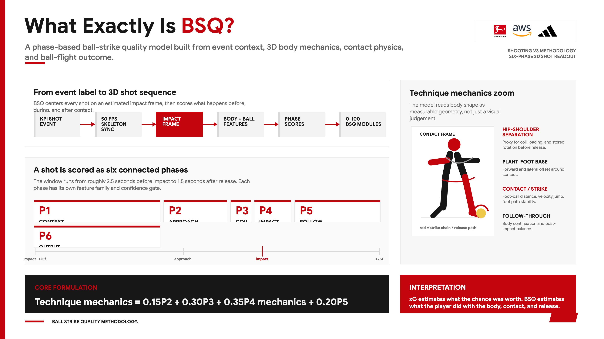

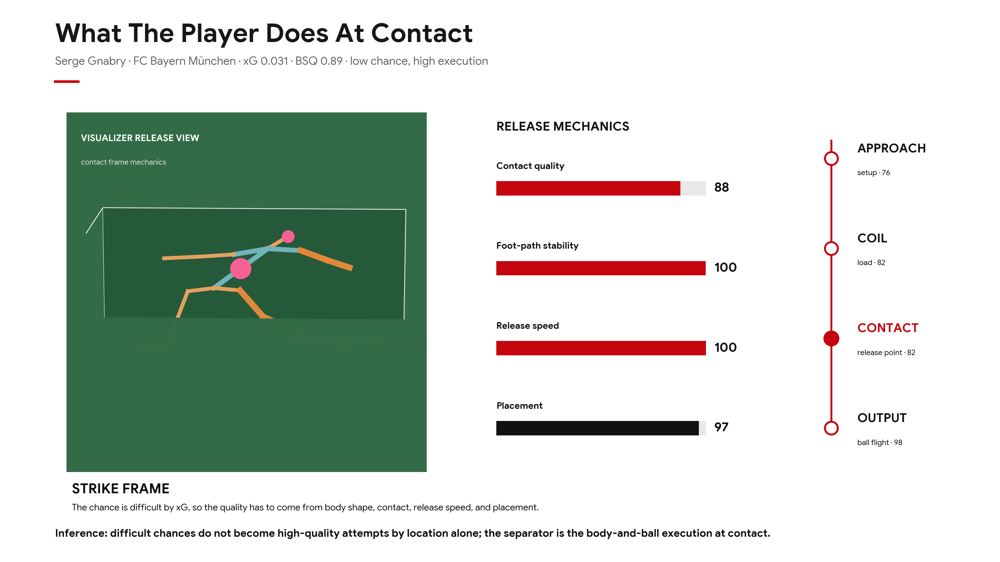

Interactive/static companion files:

- `metrics-calculation/notebooks/figures/what_exactly_is_bsq.html`
- `metrics-calculation/notebooks/figures/body_shape_at_release_visualizer.html`
- `metrics-calculation/notebooks/figures/08_body_shape_at_release.svg`

### Player and League Dashboards

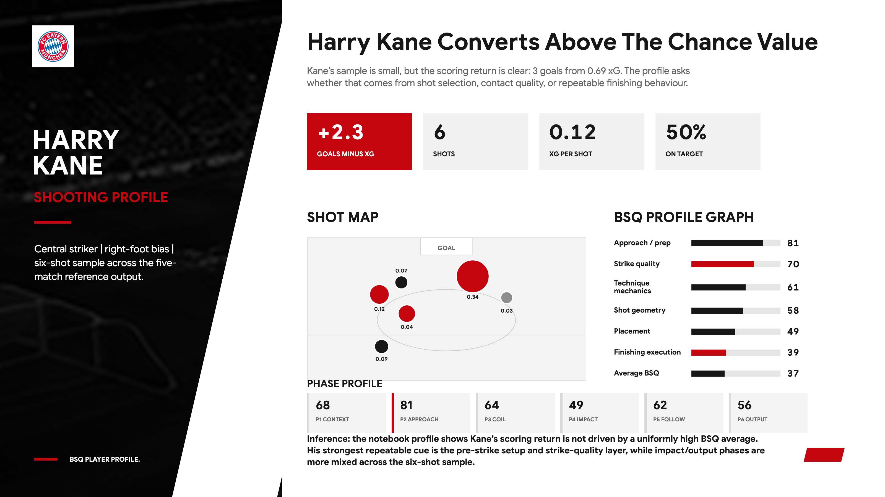

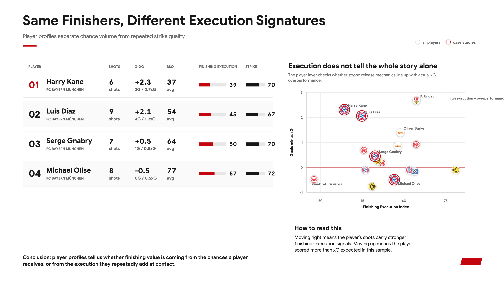

Notebook-exported profile images:

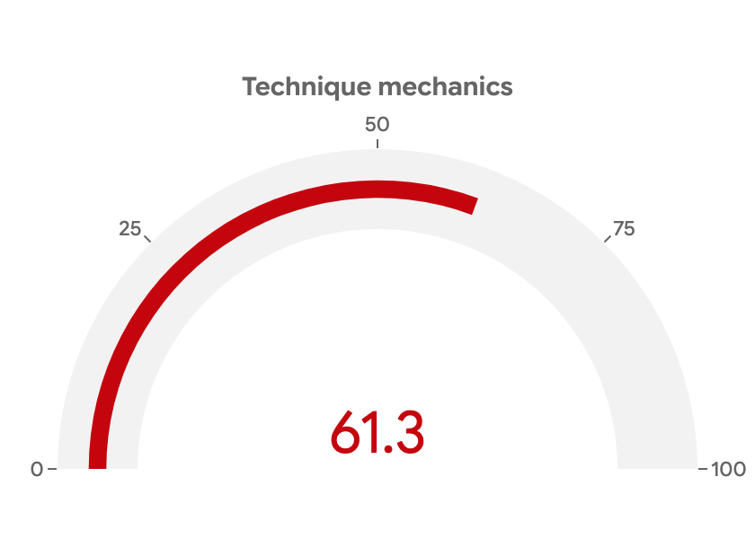

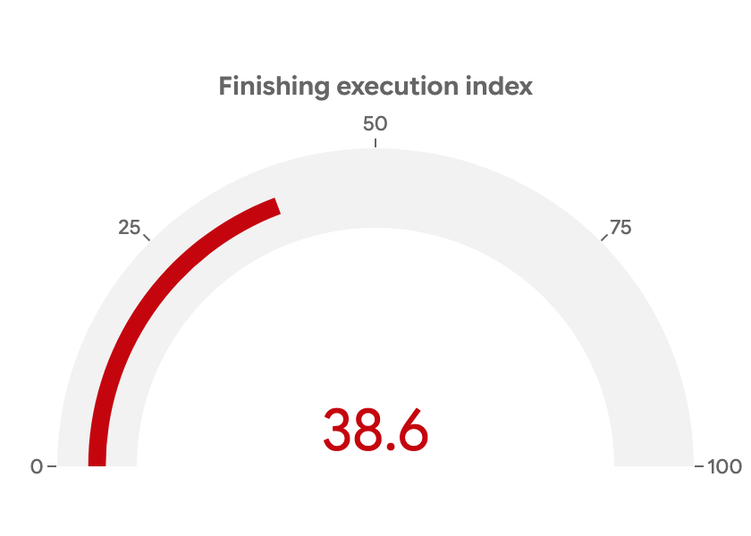

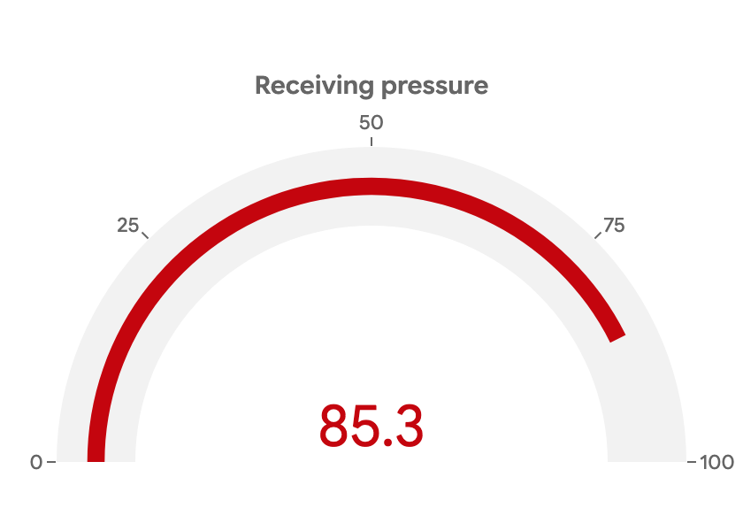

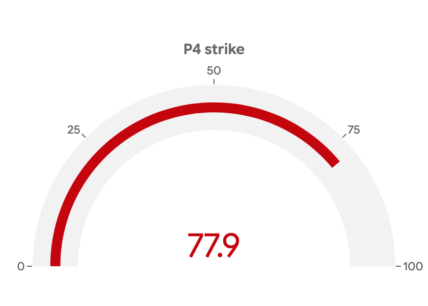

Additional notebook snapshots:

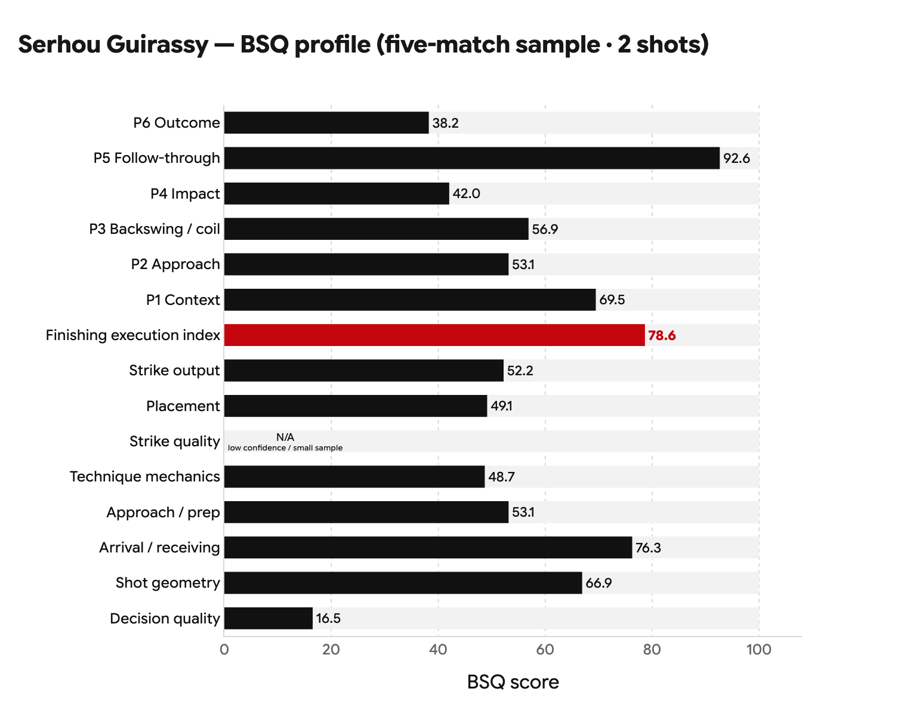

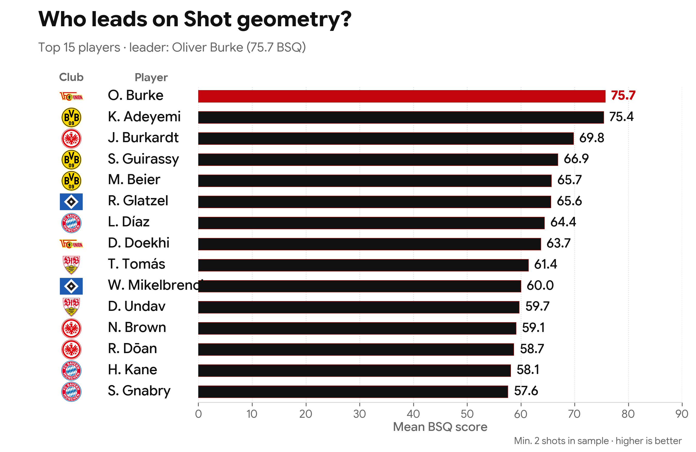

Interactive/static companion files:

- `metrics-calculation/notebooks/figures/harry_kane_shooting_profile.html`
- `metrics-calculation/notebooks/figures/player_shooting_comparison.html`

### 3D Shot Maps

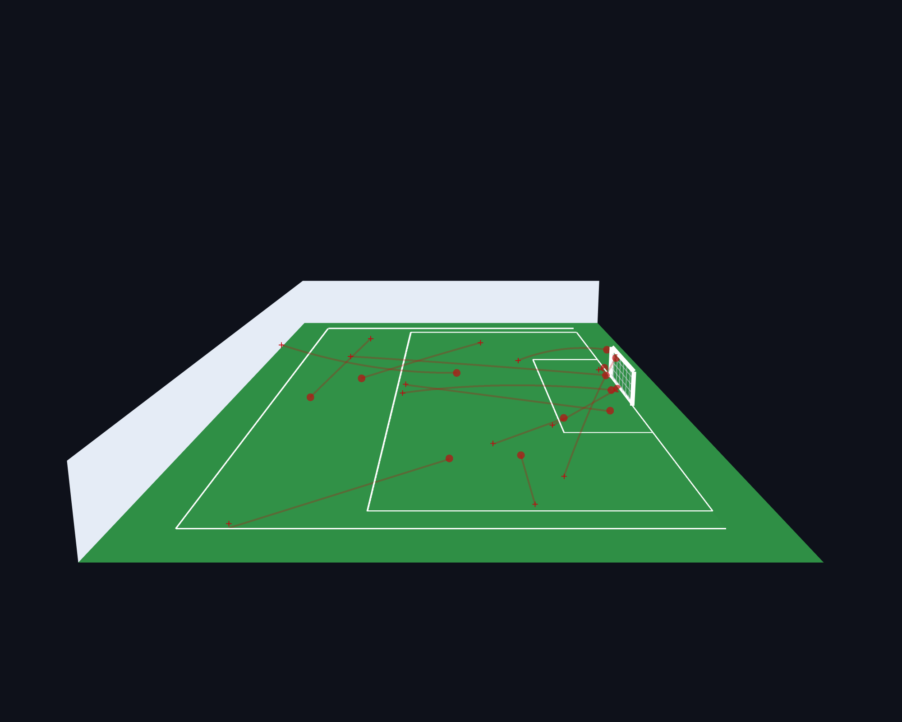

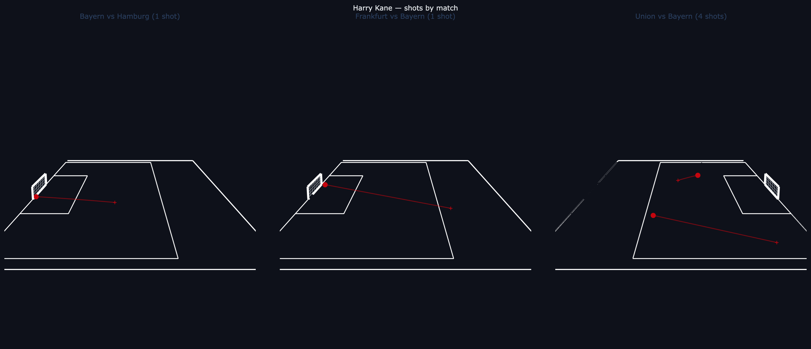

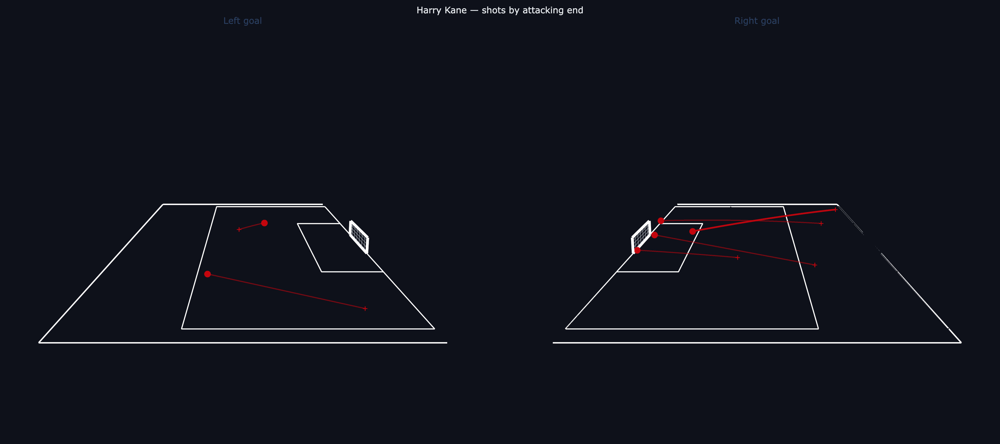

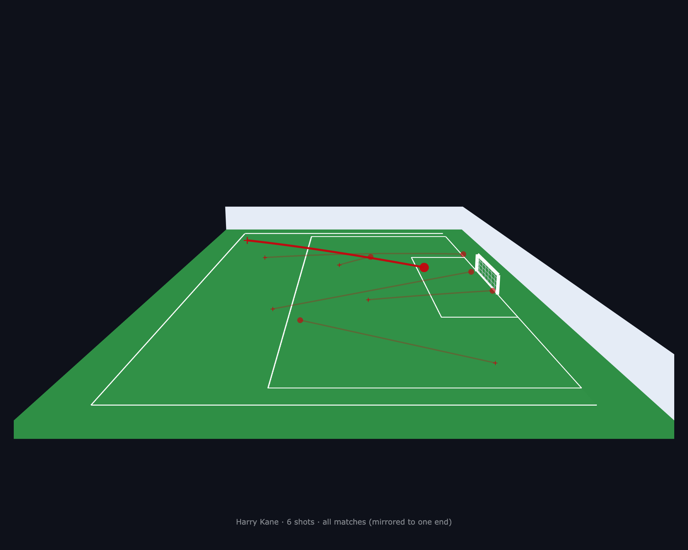

Interactive/static companion files:

- `outputs/shot_map_bayern_hamburg.html`
- `outputs/shot_map_harry_kane.html`

### Camera Selection Proof

The camera-trial contact sheet documents the view search used to select the final cinematic 3D shot-map camera.

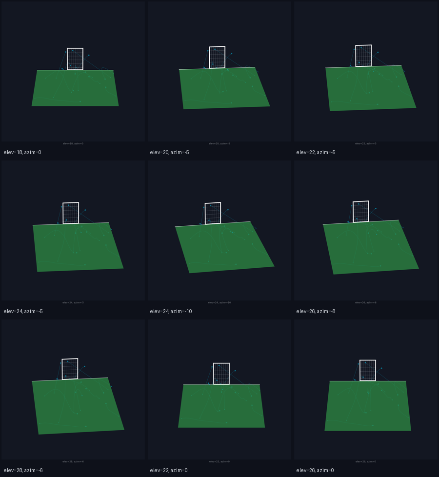

## Visualizer

Start the local 3D shot-review app:

```bash
./visualizer/scripts/serve.sh
```

Open:

```text
http://127.0.0.1:8765/visualizer/shooting.html
```

The visualizer uses the derived score rows plus live or exported shot-window data. It helps reviewers inspect a shot with:

- skeleton pose and ball path;
- contact-frame alignment;
- module and phase scores;
- event/player context;
- frame-by-frame 3D playback.

The Three.js coordinate mapping used by the visualizer is:

```text
Vector3(x, z, -y)
```

for football points `(x, y, z)`.

## Remotion Videos

The Remotion project creates explainer clips from shot-window JSON bundles:

```bash
cd shooting-videos/remotion
npm ci
npm run render:template-a
```

Important paths:

```text
shooting-videos/remotion/src/
shooting-videos/remotion/public/
shooting-videos/scripts/export_shot_bundle.sh
shooting-videos/scripts/render_template_a.sh
```

Rendered MP4 files are local/submission artifacts and should not be committed unless a small explicit deliverable is approved by the challenge rules.

## Hackathon Deliverables

The Challenge 2 zip should contain:

| Item | Requirement |
|------|-------------|
| `github_link.txt` | link to this public repo |
| `presentation_video.mp4` | under 3 minutes and below 720p |
| `executive_summary.pdf` | up to 5 slides |
| `prfaq.pdf` | optional |

The GitHub repo proves:

- source code is available;
- README has reproduction steps;
- formulation and formulas are transparent;
- no raw hackathon data is uploaded;
- reviewers can reproduce results with their own hackathon AWS/data access.

## Troubleshooting

| Issue | Likely cause | Fix |
|-------|--------------|-----|
| `HACKATHON_DATA_ROOT is not set` | full run needs XML/metadata outside repo | export `HACKATHON_DATA_ROOT=/path/outside/repo` |
| `ExpiredToken` / AWS auth error | hackathon credentials expired | refresh the `hackathon` profile and re-run `aws sts get-caller-identity` |
| empty tracking windows | S3 unavailable or `--no-s3` used | remove `--no-s3`, check profile/region and match metadata |
| missing `pyarrow`/`s3fs` | metrics dependencies not installed | `pip install -e ".[metrics]"` |
| notebooks open but static images missing | notebook deps not installed | `pip install -e ".[notebooks]"` |
| visualizer loads shell but no shot data | outputs/bundles missing | run reproduction or export shot bundles first |
| accidental raw data in git status | data folder inside clone | move it outside repo and verify `.gitignore` before committing |

## References

The BSQ formulation is based on:

- Bundesliga Challenge 2 official 3D skeleton documentation: 21 landmarks, 50 Hz parquet feed.
- Official KPI XML fields: shot events, synced frames, pressure, xG audit fields, pass/reception context.
- Kicking biomechanics literature on support-leg stability, shoulder-hip separation, proximal-to-distal sequencing, trunk posture, and foot-ball transfer.
- Football analytics concepts from xG/action-value style decision evaluation, adapted here as transparent pass-vs-shot context rather than a black-box model.

Supporting notes remain in `docs/REFERENCES.md`, while this README contains the implementable formulation used by the code.

## License

Hackathon submission. Confirm final licensing with the challenge/institution rules before broader reuse.
